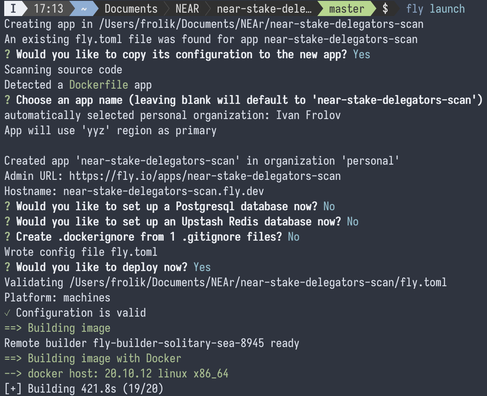
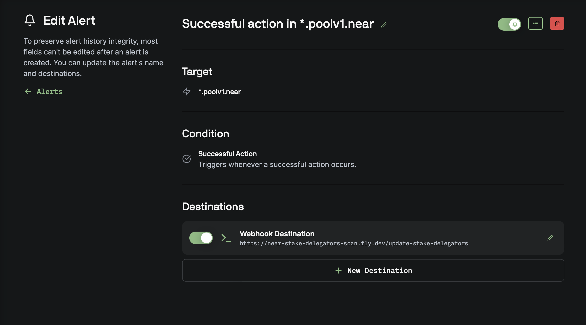

# Stake Delegators API

This Rust application provides a simple API for managing stake delegators. 

## Endpoints

- **GET Endpoint**: The `/get-stake-delegators` endpoint returns information about stake delegators in a JSON format.

Example:
```bash
curl https://near-stake-delegators-scan.fly.dev/get-stake-delegators
```
```json
{
    "timestamp": 1703627160,
    "stake_delegators": {
        "frol.near": "qbit.poolv1.near",
        "frolik.near": "qbit.poolv1.near,staked.poolv1.near",
        ...
    }
}
```

- **GET Endpoint**: The `/get-stake-delegators/<account-id>` endpoint returns information about all validators for specified delegator.

Example:
```bash
curl https://near-stake-delegators-scan.fly.dev/get-stake-delegators/frol.near
```
```json
{
    "timestamp": 1703627160,
    "stake_delegators": {
        "frol.near": "qbit.poolv1.near",
    }
}
```


- **POST Endpoint**: The `/update-stake-delegators` endpoint allows for the update of stake delegator information.

## Deployment on fly.io

Firstly, you need to create an account and authenticate:

```bash
fly auth
```

Then simply run launch command:



> To ensure high availability, especially for production apps, fly.io strongly recommend running at least 2 machines. You can scale up the number of machines using the fly scale command in the CLI. Check out the [documentation](https://fly.io/docs/apps/scale-count/#scale-the-number-of-machines-in-a-single-region) for more details.

Use show command to view current resources:

```bash
fly scale show
```

And count command to scale your app:

```bash
fly scale count 2
```

In case you want to redeploy application:

```bash
fly deploy
```

You also can view logs via cli or fly.io dashboard:

```bash
fly logs -a near-stake-delegators-scan
```
The application logs requests and errors using the `pretty_env_logger` crate and provides timestamped logs in a readable format.

The API will be accessible at generated fly.io link.

## Pagoda Console Alerts

You can either call webhook by yourself or use [Pagoda Console](https://console.pagoda.co/) to send POST request to the deployed application if new successful action happens on target *.poolv1.near  
Here's a suggested configuration:


Feel free to customize and extend the functionality based on your specific use case.
