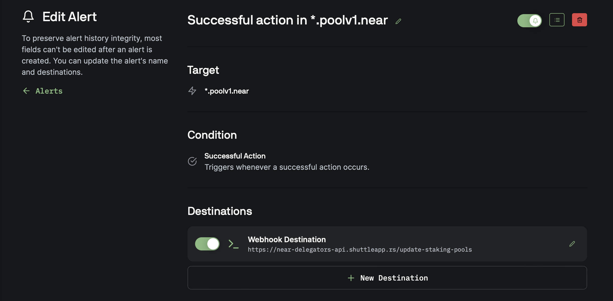

# NEAR Delegators API

This Rust application provides a simple API for managing stake delegators in NEAR protocol. 

## Endpoints

- **GET Endpoint**: The `/get-staking-pools` endpoint returns information about delegators in a JSON format.

Example:
```bash
http https://near-delegators-api.shuttleapp.rs/get-staking-pools
```

```json
{
    "timestamp": 1709599033,
    "delegator_staking_pools": {
        "frol.near": [
            "qbit.poolv1.near"
        ],
        "frolik.near": [
            "astro-stakers.poolv1.near",
            "bisontrails2.poolv1.near",
            "linear-protocol.near",
            "qbit.poolv1.near",
            "staked.poolv1.near",
            "zavodil.poolv1.near"
        ],
        ...
    }
}
```

- **GET Endpoint**: The `/get-staking-pools/<account-id>` endpoint returns information about all validators for specified delegator.

Example:
```bash
http https://near-delegators-api.shuttleapp.rs/get-staking-pools/frolik.near
```

```json
{
    "delegator_staking_pools": [
        "astro-stakers.poolv1.near",
        "bisontrails2.poolv1.near",
        "linear-protocol.near",
        "qbit.poolv1.near",
        "staked.poolv1.near",
        "zavodil.poolv1.near"
    ],
    "timestamp": 1709599415
}
```


- **POST Endpoint**: The `/update-staking-pools` endpoint allows for the update of delegator information

Expected payload:
```json
{
    "chain_id": "Mainnet",
    "alert_rule_id": 361,
    "alert_name": "Successful action in *.poolv1.near",
    "payload": {
        "Actions": {
            "block_hash": "9R9oPcCtUyXcYmQnq89vwsiBExVyfapcD77osqdUHGhT",
            "receipt_id": "4VNyXQdiHWD79rvWhLqmBr6FqrRndsbpQbBV7dUSjpov",
            "transaction_hash": "DTtiZnEeA8YQSjhtmHMBozrQFepevmtg1wzxq62qvroD"
        }
    }
}
```

## Setting up

### Pagoda Console Alerts

Firstly, you need to subscribe for updates using [Pagoda Console](https://console.pagoda.co/). It has configurable alerts to send POST request to the deployed application whenever a new successful action happens on target *.poolv1.near  

Here's a suggested configuration:


Feel free to customize and extend the functionality based on your specific use case.


### Deployment on shuttle.rs

#### Installation

```bash
cargo install cargo-shuttle
```

#### Creating your project

```bash
cargo shuttle init
```

#### Deployment

1) Start project
```bash
cargo shuttle project start
```

2) Deploy
```bash
cargo shuttle deploy --allow-dirty
```
> [!NOTE]  
> `--allow-dirty` or `--ad` allows deploying with uncommitted git changes

#### Status
```bash
cargo shuttle status
```

#### Logs

```bash
cargo shuttle logs --follow
```

You also can view logs on shuttle.rs dashboard:

The application logs requests and errors using the `pretty_env_logger` crate and provides timestamped logs in a readable format.

The API will be accessible at generated shuttle.rs link.
